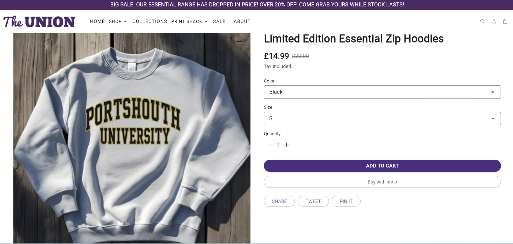
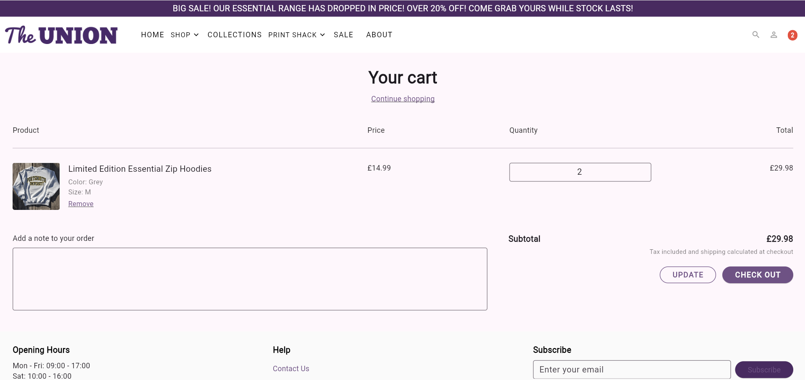

# 🎓 Union Shop — Flutter Web Coursework (UPSU)

> A full e-commerce Flutter Web application recreating the UPSU Union Shop website, built for University of Portsmouth coursework.  
> Coursework specification reference: <sup>[Coursework brief (SharePoint)](https://portdotacdotuk-my.sharepoint.com/:w:/g/personal/mani_ghahremani_port_ac_uk/EbM1UcwOHMRLmcKeI0btHqYBeZ3ADWjyN0EXBWdHLhsO_g?e=o7AjLb)</sup>

---

## 📌 Overview

This project recreates the **UPSU Union Shop** as a **Flutter Web application**, implementing multi-page navigation, collections, product pages, cart functionality, authentication, Print Shack personalisation, and full responsiveness.

The goal is to demonstrate **Flutter UI**, **state management**, **navigation**, **testing**, and **cloud integration** (Firebase Hosting + Firebase Auth) exactly as required by the coursework brief.

---

## ✨ Key Capabilities (High-Level)

- Responsive homepage with hero image carousel  
- Product listings, collections, and signature ranges  
- Dynamic product page with gallery, size/color selectors  
- Complete cart workflow (add/remove/update/total)  
- Authentication via Firebase Email/Password  
- Print Shack personalisation with dynamic preview  
- Mobile & desktop layouts with adaptive navigation  
- Firebase hosting deployment  
- Thorough widget and model testing  
- Clean project structure with reusable components  

---

# 📦 Features by Coursework Category

## **Basic Features (40%)**
| Feature | Status |
|--------|--------|
| Static Homepage | ✅ |
| About Us Page | ✅ |
| Footer widget | ✅ Reusable across all pages |
| Dummy Collections Page | ✅ |
| Dummy Collection Page | ✅ |
| Dummy Product Page | ✅ |
| Sale Collection | ✅ |
| Authentication UI | ✅ |
| Static Navbar | ✅ |

---

## **Intermediate Features (35%)**
| Feature | Status |
|--------|--------|
| Dynamic Collections Page | ✅ |
| Dynamic Collection Page w/ filtering | ✅ |
| Functional Product Page (options, gallery) | ✅ |
| Shopping Cart (add/remove/update) | ✅ |
| Print Shack Personalisation Page | ✅ |
| Full Navigation System | ✅ |
| Responsiveness (mobile & desktop) | ✅ |

---

## **Advanced Features (25%)**
| Feature | Status |
|--------|--------|
| Authentication System (Firebase Auth) | ✅ |
| Cart Management w/ totals | ✅ |
| Search System | ✅ |
| External Cloud Services (Firebase Hosting + Auth) | ✅ |

---

# 🧭 Routing Table

| Route | Description |
|-------|-------------|
| `/` | Home |
| `/about` | About page |
| `/collections` | Collections overview |
| `/collections/:id` | Specific collection |
| `/product/:id` | Product detail |
| `/cart` | Shopping cart |
| `/merch` | Merch landing |
| `/clothing` | Clothing collection |
| `/signature` | Signature range |
| `/sale` | Sale collection |
| `/print-shack` | Print Shack info |
| `/print-shack/personalisation` | Personalisation flow |
| `/auth` | Authentication page |

---

# 📁 Project Structure

Top-level overview (important files/folders)

- `lib/` — application source (Dart)
	- `main.dart` — app entry and route registration
	- `product_catalog.dart`, `product_page.dart` — product-related pages
	- `collections_page.dart` — collections list
	- `specific_collection_page.dart` — collection detail
	- `cart_page.dart` — cart UI
	- `print_shack_personalisation.dart` — print shack personalisation flow
	- `authentication.dart` — authentication page & logic
	- `sale.dart`, `merch_page.dart`, `clothing.dart`, `signature_page.dart` — collection pages
	- `widgets/` — reusable widgets
		- `app_header.dart`, `app_footer.dart`, `adaptive_image.dart`, `product_card.dart`, `shop_nav_dropdown.dart`, `print_shack_nav_dropdown.dart`, `product_card.dart` etc.
	- `models/` — data models and logic
		- `product.dart` — Product model (id, title, price, imageUrl, optional oldPrice, galleryImages)
		- `personalisation_product.dart` — Print Shack model
		- `cart_model.dart` — cart state and operations (Provider)
- `test/` — unit & widget tests
- `assets/` — images, fonts; referenced by `pubspec.yaml`
- `build/` — generated artifacts (after `flutter build web --release`)
- `pubspec.yaml` — dependencies and asset definitions
- `firebase.json`, `.firebaserc` — Firebase Hosting config (created when you run `firebase init hosting`)


Purpose of each layer
- UI / Pages (`lib/*.dart`): screens that compose the SPA or multi-page experience; respond to navigation and user interactions.
- Widgets (`lib/widgets/`): small, reusable UI components to enforce consistency (header, footer, adaptive images).
- Models (`lib/models/`): domain objects (Product, CartModel) and business logic (add/remove/update).
- Tests (`test/`): automated tests (widget tests for UI and unit tests for models).
- Assets & pubspec: media, fonts, and dependency declarations that Flutter packages into the web build.

---

## Setup & installation

Prerequisites
- Flutter (recommended: stable channel). The project was developed and validated with Flutter 3.x (use a current stable release). To check your Flutter version:
```powershell
flutter --version
```
- Node.js & npm (if not installed, required for firebase-tools installation)
- Firebase CLI (for deploying to Firebase Hosting)
	```powershell
	npm install -g firebase-tools
	firebase login
	```

Clone repository
```powershell
git clone https://github.com/Nikol304/union_shop.git
cd union_shop
```

Install dependencies
```powershell
flutter pub get
```

Run the app locally (Chrome)
```powershell
flutter run -d chrome
# Or for the web-server device:
flutter run -d web-server
```

Build for web (production/release)
```powershell
# Builds a release-ready static app in build/web
flutter build web --release
```

Quick notes
- If you edit `pubspec.yaml` (add assets or packages), always re-run `flutter pub get`.
- Use `flutter analyze` to run static analysis, and `dart format .` or `flutter format .` to format code.

---

## External cloud services integration

This project integrates Firebase for authentication and hosting. The README documents the steps used and recommendations for redeployment.

Firebase Hosting setup (what we did)
1. Install Firebase CLI and login:
```powershell
npm install -g firebase-tools
firebase login
```
2. Initialize hosting (run in project root):
```powershell
firebase init hosting
```
- Choose “Use an existing project” or create a new project.
- For the public directory, specify `build/web`.
- Answer “Yes” to rewrite all URLs to `index.html` for SPA behavior.
- The initializer will create `firebase.json` and `.firebaserc`.

Example `firebase.json` (auto-created)
```json
{
	"hosting": {
		"public": "build/web",
		"ignore": [
			"firebase.json",
			"**/.*",
			"**/node_modules/**"
		],
		"rewrites": [
			{
				"source": "**",
				"destination": "/index.html"
			}
		]
	}
}
```

Deploying to Firebase Hosting
- Build web assets:
```powershell
flutter build web --release
```
- Deploy:
```powershell
firebase deploy --only hosting
```

Firebase Authentication (email)
- This project uses Firebase Authentication for basic email/password flows.
- Setup:
	- In the Firebase console, enable Email/Password sign-in provider.
	- No Firestore/Realtime DB are required for the current app; only Auth is used.
- Security rules:
	- If you later add Firestore or Storage, define strict security rules. For Auth-only usage, ensure you do not expose client-side keys or secrets and require authenticated access where relevant.
	- Example note: do not store sensitive server keys in repository; use environment variables or Firebase Functions for server-side secrets.

Redeploy notes
- After making changes and re-building (`flutter build web --release`), re-run:
```powershell
firebase deploy --only hosting
```
- For CI/GitHub Actions: Firebase can automatically deploy on push (GitHub workflow), but we kept that disabled by default.

---

## Full routing table

Below is the canonical routing table (named routes and main app routes used across the project). Some pages (like `SpecificCollectionPage` and Product pages) may use `MaterialPageRoute` with parameters instead of strict named routes — the below lists logical routes and expected parameters.

| Route | Page |
|-------|------|
| / | Home page (hero carousel, sections) |
| /product/:id | Product page (product detail, gallery) |
| /cart | Cart page (line items, totals) |
| /collections | Collections listing page |
| /collections/:name | Specific collection page (collection products) |
| /sale | Sale page |
| /merch | Merch page |
| /signature | Signature range page |
| /about | About page |
| /print-shack | Print Shack info page |
| /print-shack/personalisation | Print Shack personalisation (accepts a PersonalisationProduct instance in navigation) |
| /auth | Authentication page (email/password & continue flow) |
| /search?query=... | Search results (search delegate opens results) |

Notes:
- Product & collection detail pages are sometimes built via `MaterialPageRoute` so the actual app does not rely exclusively on deep-named routes; the above is a helpful developer mapping for coursework documentation and testing.
- Route parameters format shown with `:id` or `:name` is the expected logical shape (the project passes product identifiers through constructor parameters or route arguments).

---

## Screenshots (placeholders)

Add these images to `docs/screenshots/` and update the README with real images later.

- Home (desktop): `docs/screenshots/home_desktop.png`  
	

- Product page (gallery): `docs/screenshots/product_page.png`  
	

- Cart page: `docs/screenshots/cart_page.png`  
	

- Mobile navigation (sandwich menu): `docs/screenshots/mobile_nav.png`  
	

- Print Shack Personalisation: `docs/screenshots/personalisation_page.png`  
	

(Replace placeholders with real screenshots before submission. Good practice: include both desktop and narrow/mobile crops.)

---

## Testing

How to run tests
```powershell
# Run all tests
flutter test

# Run a single test file
flutter test test/product_test.dart
```

Summary of tests included
- Widget tests:
	- `home_test.dart` — ensures Home page widgets render without exceptions (hero carousel, key sections).
	- `product_test.dart` — product card & product page widget behavior (Add to Cart interactions simulated).
- Model/unit tests:
	- `cart_model_test.dart` (or similar) — tests for `CartModel` (addItem, removeItem, updateQuantity, totals).
- The test suite uses `flutter_test` and simulates builds of Widgets with `WidgetTester`.

Example test snippet (Dart)
```dart
import 'package:flutter_test/flutter_test.dart';
import 'package:union_shop/models/cart_model.dart';
import 'package:union_shop/models/product.dart';

void main() {
	test('CartModel adds and totals correctly', () {
		final cart = CartModel();
		final p = Product(id: 't-1', title: 'Test', price: 5.0, imageUrl: '');
		cart.addItem(p);
		expect(cart.items.length, equals(1));
		expect(cart.totalPrice, equals(5.0));
		cart.addItem(p, quantity: 2);
		expect(cart.totalPrice, equals(15.0)); // 3 * 5.0
	});
}
```

Best practices for tests
- Keep tests small and deterministic.
- Use `pumpWidget` + `MaterialApp` wrapper for widget tests that require routing or inherited widgets (e.g., Provider).
- Mock network or Firebase calls when unit testing logic that depends on external services.

---

## Software development practices

Commit cadence
- Frequent small commits with descriptive messages, e.g.:
	- feat: add print shack personalisation page
	- fix: correct sale product data
	- chore: run formatter
- Commit messages follow conventional style (type: short description). Maintain small atomic commits to make code review and grading easier.

Branching
- Main branch (`main`) contains the stable submission candidate.
- Create feature branches (e.g., `feat/personalisation`, `fix/sale-data`) for development and merge via PRs for traceability.

Code formatting & linting
- Run `dart format .` or `flutter format .` to format code consistently.
- Use `flutter analyze` to check for static analysis hints and errors.
- Prefer const constructors / const literals where appropriate to improve performance.

Use of AI assistance
- AI tools (e.g., Copilot) were used as a development aid; all final code was reviewed and edited manually to ensure correctness and meet coursework requirements. Document any AI-assisted changes in commit messages as appropriate for academic integrity.

Repository hygiene
- Keep secrets out of the repo — do not commit Firebase service account keys or other secrets.
- Add `.gitignore` for `build/`, `.dart_tool/`, and IDE-specific files.

---

## Limitations & future improvements

Known limitations
- No server-side product ordering or persistence (cart is client-side only). If the server or database were added, persistent orders could be created.
- No payment gateway integration (out of scope for coursework).
- Authentication uses basic Firebase Auth — account management pages (password reset, email verification) are minimal or not implemented.
- Some layout edge-cases may need tweaks for very small screens (below 320px).
- Asset packaging: newly added assets may require a fresh `flutter clean` and rebuild to include them in `AssetManifest`.

Suggested future improvements
- Integrate Firestore for product inventory and persistent orders.
- Add payment integration (Stripe, PayPal) and order confirmation flows.
- Implement admin pages for adding/editing products (authenticated admin).
- Add e2e tests using integration_test.
- Add image optimization and CDN integration for assets.
- Improve accessibility (ARIA roles, semantic labels, keyboard navigation).
- Add automated CI builds and GitHub Actions to run tests and deploy.

---

## License & acknowledgements

License
- This repository is provided for coursework. Add an appropriate license here (e.g., MIT) or follow your university submission policy.

Acknowledgements
- University of Portsmouth coursework spec (assignment brief)
- Flutter & Firebase documentation
- Example assets and icons (acknowledge any third-party media if used)
- Any contributors (peers / tutors) should be listed here.

---

## Appendix: Useful commands (PowerShell)

Clone & setup
```powershell
git clone https://github.com/Nikol304/union_shop.git
cd union_shop
flutter pub get
```

Run locally
```powershell
flutter run -d chrome
```

Build production web
```powershell
flutter build web --release
```

Initialize Firebase hosting (one-time)
```powershell
npm install -g firebase-tools
firebase login
firebase init hosting
# When prompted, use public directory: build/web
# Choose SPA rewrites: Yes
```

Deploy to Firebase Hosting
```powershell
flutter build web --release
firebase deploy --only hosting
```

Run tests
```powershell
flutter test
```

Format & analyze
```powershell
dart format .
flutter analyze
```

---

Final notes for submission
- Ensure the `build/web` artifacts are created prior to running `firebase deploy`.
- Replace placeholder deploy URL and screenshots with actual assets before coursework submission.
- Double-check you have enabled Email/Password sign-in in your Firebase project if you use Authentication.


